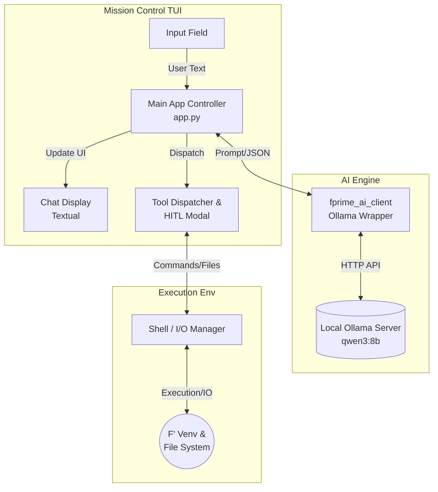

# Design: System Architecture

## 1. Architectural Overview
Mission Control is designed using a layered architecture pattern. It separates the User Interface (Textual), the AI Orchestration (Ollama/Python), and the System Execution (Subprocess/File I/O). This ensures that UI freezes do not occur during heavy command execution, and that the AI logic is cleanly decoupled from terminal rendering.

## 2. Component Diagram

## 3. Core Modules

### 3.1. Main App Controller (`app.py`)
*   **Technology:** Textual App instance.
*   **Responsibilities:**
    *   Manages the lifecycle of the UI widgets (Chat Log, Input Bar, Status Bar).
    *   Intercepts user input. If prefixed with `/`, routes to the Execution Env directly.
    *   Otherwise, routes natural language to the `fprime_ai_client`.
    *   Handles asynchronous UI updates (e.g., streaming tokens from the LLM, streaming standard output from shell commands).
    *   Manages the Human-In-The-Loop (HITL) confirmation dialogs by overlaying a Textual Modal Screen.

### 3.2. AI Engine (`fprime_ai_client.py`)
*   **Technology:** `ollama-python` asynchronous client.
*   **Responsibilities:**
    *   Maintains the conversational memory (list of message dicts).
    *   Injects the `System Prompt` (defining the persona and tools).
    *   Handles the ReAct loop: sending the prompt, receiving the stream, detecting if the stream contains a JSON Tool Call, and returning control to the Dispatcher.

### 3.3. Tool Dispatcher
*   **Technology:** Pure Python routing logic (likely within `app.py` or a dedicated `tools.py`).
*   **Responsibilities:**
    *   Maintains a dictionary mapping tool names (e.g., `"read_file"`) to Python functions.
    *   Parses the JSON payload emitted by the AI.
    *   Validates the arguments against the expected Tool API schema.
    *   Invokes the corresponding Execution logic.
    *   Formats the result back into a standard "Tool Response" string for the AI context.

### 3.4. Execution Environment (Shell / I/O Manager)
*   **Technology:** `asyncio.create_subprocess_shell` and `aiofiles`.
*   **Responsibilities:**
    *   **Venv Resolution:** Dynamically finds `fprime-venv/bin/activate`.
    *   **Command Execution:** Wraps F' commands with the venv activation source string. Captures `stdout` and `stderr` asynchronously, yielding lines back to the UI so the user isn't staring at a frozen screen during a long `fprime-util build`.
    *   **File Operations:** Safely executes file reads and exact-match string replacements.

## 4. Concurrency Model
The entire application runs on `asyncio`. 
*   Textual runs its own event loop. 
*   **Ollama Client API:** The `ollama` Python package uses asynchronous HTTP clients (`httpx` or `aiohttp` under the hood) to communicate with the Ollama server running locally on port 11434. Even though it's local, these are still network requests that must be awaited so they do not block the UI thread.
*   Subprocesses use `asyncio` subprocess streams. 
*   **Crucial Rule:** No synchronous blocking operations (like `time.sleep()` or synchronous `open().read()` for large files) should occur on the main thread, as this will immediately freeze the TUI. Use Textual's `@work` decorator for background tasks.